# Learnly: Your Personalized Focus & Productivity Companion

## Overview
**Learnly** is a mobile productivity application designed to help students and professionals stay focused, track their progress, and minimize distractions. It integrates a variety of deep work tools like Pomodoro, stopwatch, clock, and custom challenges alongside a personalized AI chatbot assistant — all within an engaging and modern UI.

This project is part of the **Mobile Application Lab Project** under the supervision of **Mezbaul Islam Zion**.

---

## 🌟 Features

### 🔐 Authentication & Onboarding

- Secure login/signup with Google Authentication
- Seamless onboarding experience

### 🏠 Dashboard & Core Tools
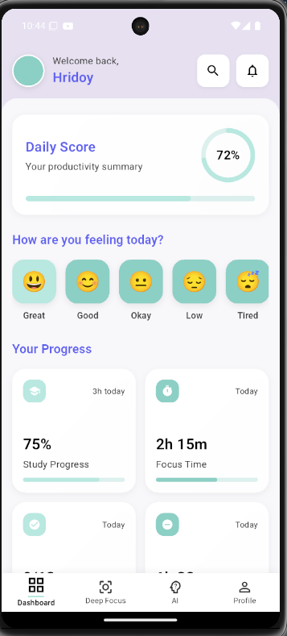
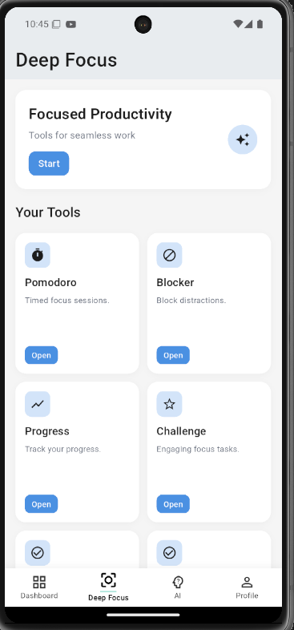
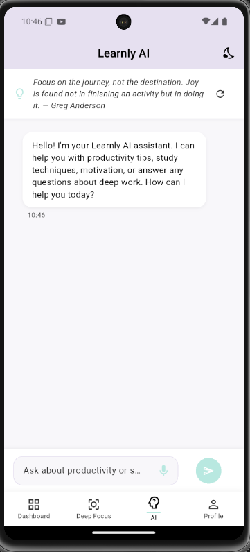
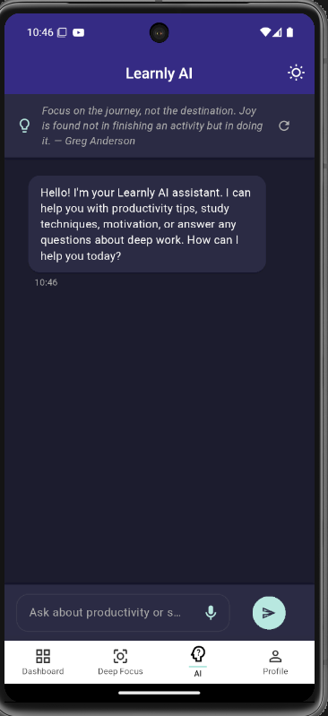
- Clean and intuitive dashboard
- Deep Focus Zone (Pomodoro, stopwatch, etc.)
- Built-in AI chatbot for personalized productivity support

### 👤 Profile & Customization
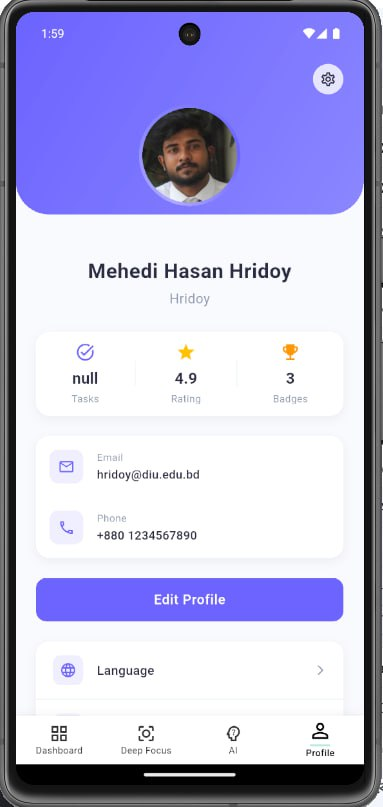
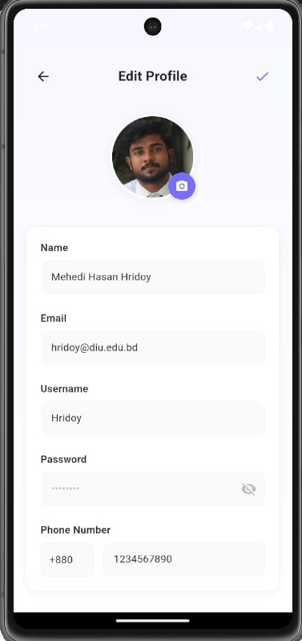
- Profile management
- Personalized focus timer configuration

### 📈 Progress Tracking
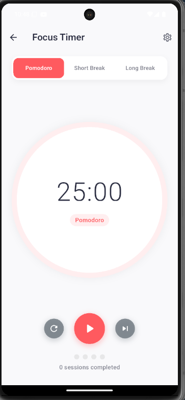
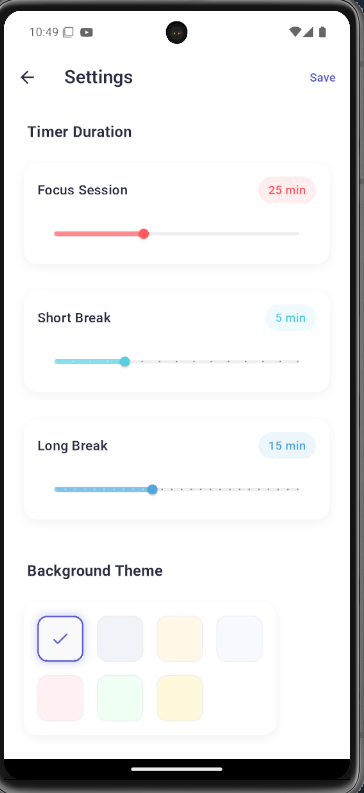
- Track daily, weekly, and monthly study sessions
- Visual insights and analytics

### ⏱️ Timer Tracker
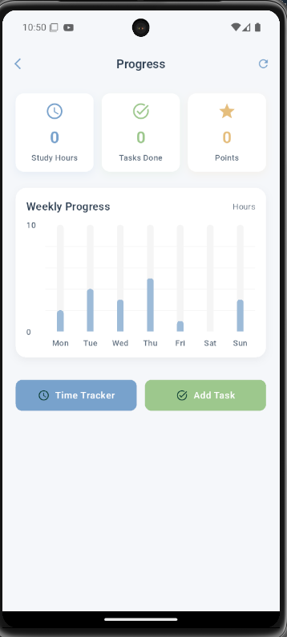
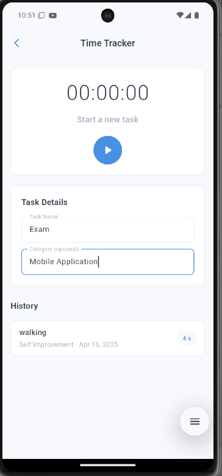
- Review past sessions
- Monitor task completion time

### 🎯 Challenge Yourself
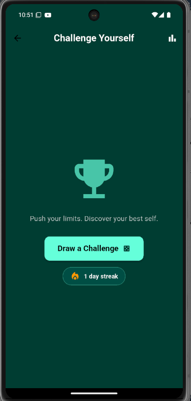
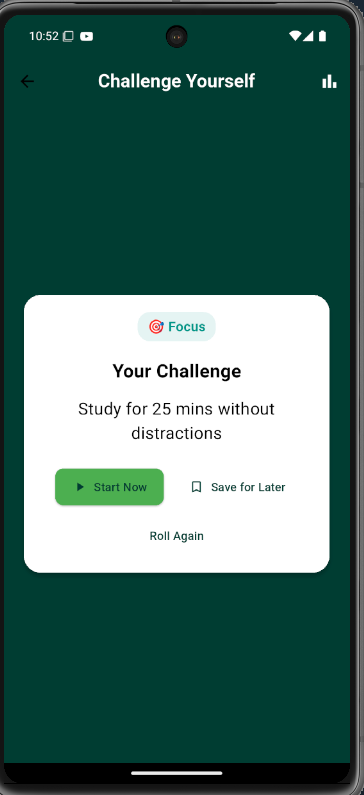
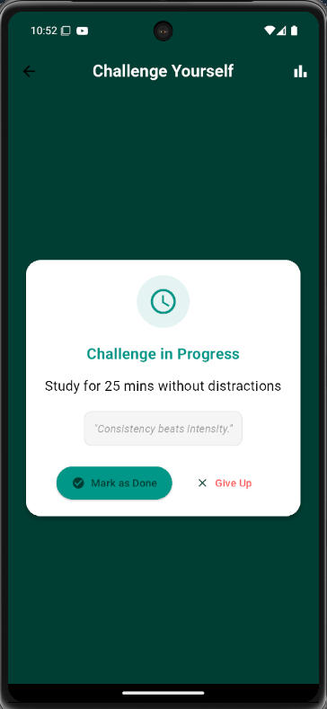
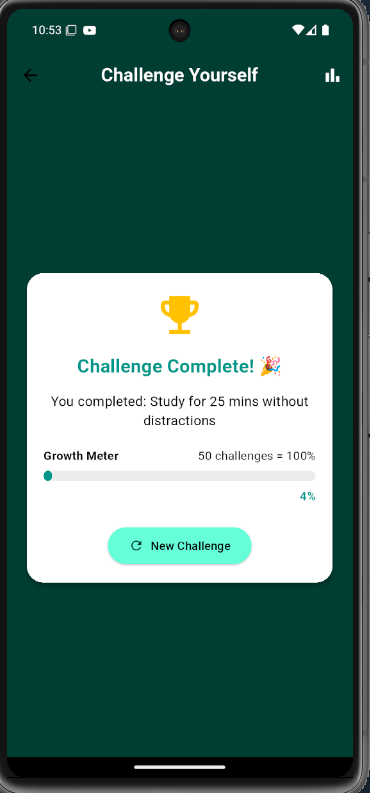
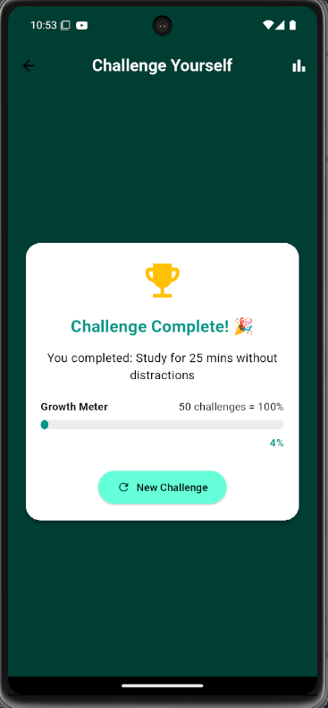
- Gamified productivity challenges
- Set goals and push your limits

### ✅ To-do List & Daily Planner
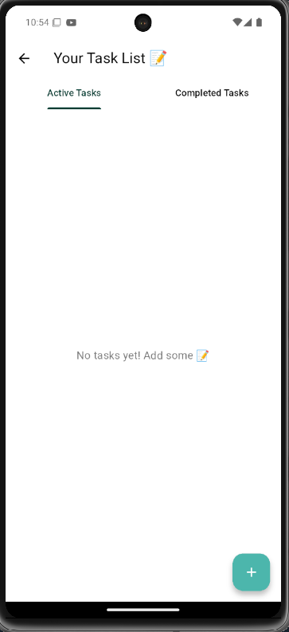
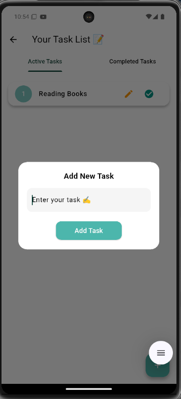
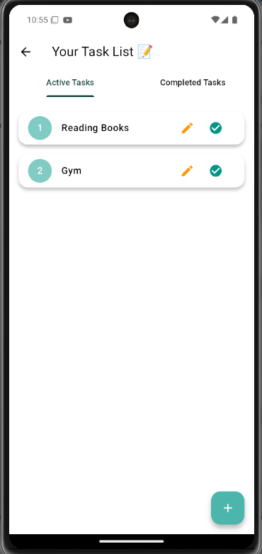
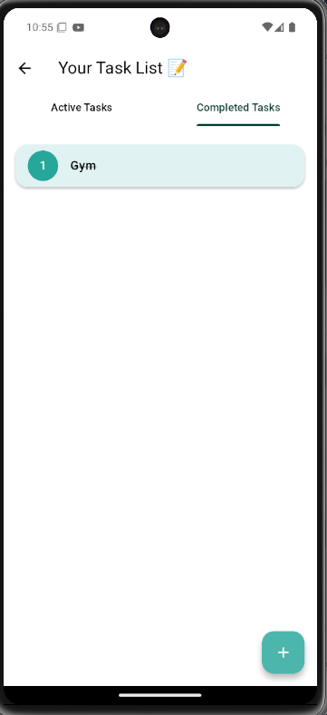
- Organize tasks
- Prioritize focus sessions

### 🕰️ Modern Clock
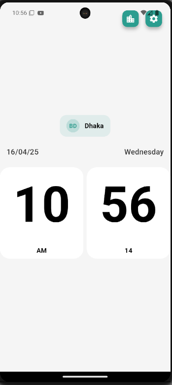
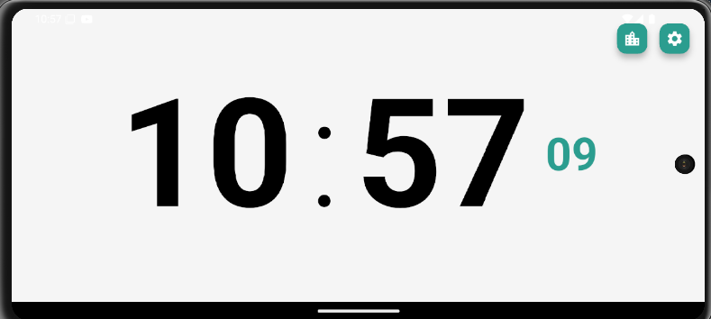
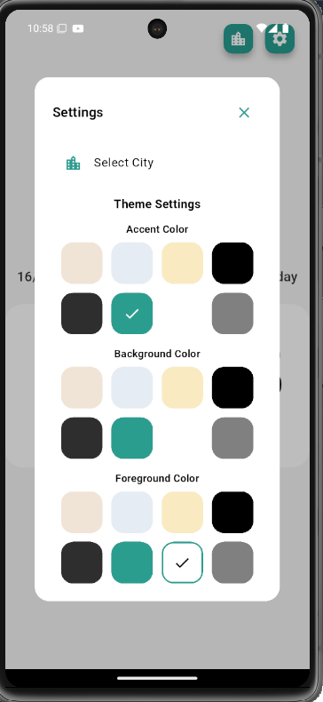
- Aesthetic clock designs
- Integrated with focus modes

---

## 🤖 AI Chatbot Assistant
- Personalized productivity tips
- Motivational nudges and insights
- AI-generated challenges

---

## 👥 Team Behind Learnly
- **Mehedi Hasan Hridoy** – Project Lead & Core Development
- **Umme Salma Lamyea** – UI/UX Design
- **A.K.M Sadiqul Islam** – Authentication & Backend Implementation
- **Ekram Hossain** – Market Research & Design Implementation
- **Saidur Rahaman Zahir** – Feature Development & Innovation Research

---

## 🎓 Academic Context
**Course**: Mobile Application Lab  
**Instructor**: Mezbaul Islam Zion

---

## 📎 Useful Links
- **Project Presentation**: [View Here](https://tinyurl.com/learnly)
- **Project Report (PDF)**: [Google Drive](https://drive.google.com/file/d/1__KXJZbZSSlSvW7tGscSpaVFirws9dyq/view?usp=drive_link)
- **All Assets & Screenshots**: [Screenshots Drive Folder](https://drive.google.com/drive/folders/1AwcKSTUL756OO0ktv-CKdDhIF9sutbht)

---

## 📲 Try Learnly
Coming soon to Android and iOS platforms!

---

> "Your mind is a garden. Learnly is the gardener that helps keep out the weeds of distraction and nurtures your focus."

